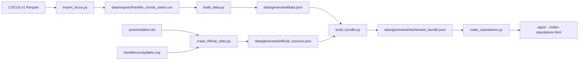

# Architecture

## Repository layout

```
Preston-Franklin-County-Idaho/
├── apps/
│   └── local-laws-dashboard/     # Static civic law explorer
│       ├── index.html              # Dev version (fetches JSON)
│       ├── index-standalone.html   # Production (embedded data)
│       └── start.bat               # Local preview server
├── data/
│   ├── exports/                    # Small committed CSV snapshots
│   └── generated/                  # Build artifacts (gitignored)
├── scripts/
│   ├── paths.py                    # Shared path constants
│   ├── export_locus.py             # Pull Franklin County from HuggingFace
│   ├── build_data.py               # CSV → data.json
│   ├── crawl_official_sites.py     # Crawl Preston + County sites
│   ├── build_bundle.py             # Merge all sources
│   ├── make_standalone.py          # Embed bundle for offline/GitHub Pages
│   └── build_all.py                # Full pipeline
└── docs/
    ├── ROADMAP.md
    └── ARCHITECTURE.md
```

## Data flow (Local Laws Dashboard)



## Adding a new citizen tool

1. Create `apps/<tool-name>/` with its own README
2. If it needs shared data, add a script under `scripts/` and document inputs in `data/exports/`
3. Link to official sources in the UI header (same pattern as the laws dashboard)
4. Add the tool to `docs/ROADMAP.md` with status

## Deployment (GitHub Pages)

Publish `apps/local-laws-dashboard/index-standalone.html` as the site root, or add a future hub `index.html` at repo root that links to all apps.

```bash
python scripts/build_all.py
git add apps/local-laws-dashboard/index-standalone.html
git commit -m "Rebuild dashboard data"
```

## Crawler constraints

- Same-domain crawl for prestonidaho.net and franklincountyidaho.org
- Rate-limited requests (~0.35s delay)
- Captures linked official resources (AmLegal, Revize agendas) as external references
- Re-run periodically to pick up new forms and announcements